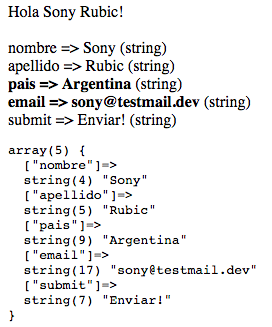

# 01-request-basico

### Prácticas guiadas
##### Setup
1. Hacer `git pull` de los archivos [formulario.html](formulario.html) y [respuesta.php](respuesta.php).
2. Abrir [formulario.html](formulario.html) en el browser y ambos archivos en el editor.
3. Enviar el formulario.

##### Ejercicios
1. Cambiar <?php por <? y escribir algo en html previo a este código.
2. Agregar un valor a $_GET de la forma `$_GET[‘miclave’] = ‘mivalor’;`
3. Agregar un texto al final de los valores que se imprimen (en la línea nro. 4)

### Prácticas de a pares
##### Setup
Hacer `git reset --hard` para volver a la versión original de los archivos.

##### Ejercicios
1. Imprimir, previo al loop, un mensaje de bienvenida con el nombre y el apellido.
1. Agregar un if para dos nombres de variables y hacer que se impriman en negrita.
1. Luego del loop e impresión de datos, Imprimir todas las variables recibidas con el comando var_dump($_GET)
1. **Avanzadas**
  1. Obtener el tipo de dato de la variable e imprimirlo luego del valor.
  1. Evaluar el tipo de dato para imprimir en negrita.

##### Resultado esperado
 
[Ver imagen](resultado.png)

### Quizz multiple choice
[Link a quizz](http://www.google.com)

1. ¿Cómo hago para obtener un item específico de un array?
1. ¿Cómo hago para concatenar variables de texto o - numéricas?
1. ¿Cómo hago para imprimir una variable o un texto estático?

### Prácticas integradoras
##### Setup
Hacer `git reset --hard` para volver a la versión original de los archivos.

##### Ejercicios
1. Armar placeholders para las variables esperadas. Imprimir el valor de cada una.
1. Validar que los tipos de variables sean los esperados o mostrar un mensaje de error.
1. Mostrar un mensaje de error por cualquier variable adicional que no sea esperada.
